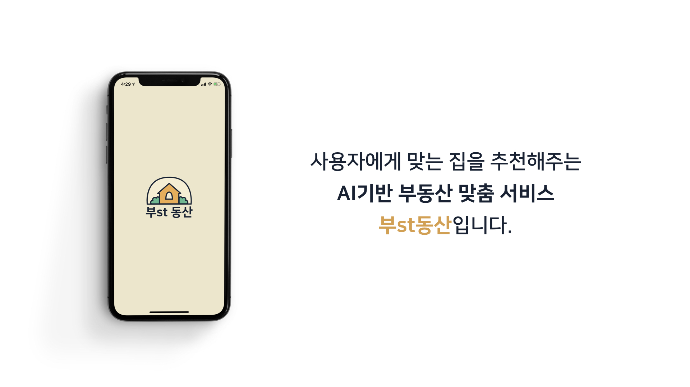

# relay_19

## Week1

### 참여자
고세림, 박재현, 박성민, 류연수, 박지훈, 강민석, 남기범, 권지웅, 강병민, 문성주, 강병영, 김근수

### 프로젝트 기획

- [주제 선정](./week1.md)
- [세부사항](https://github.com/boostcamp-2020/relay_19/wiki)

## Week2

### 참여자
강민석, 강병민, 남기범, 류연수, 송승열, 송민관, 유원상, 윤병휘, 장지석, 전재열, 채훈기, 최광현

### 자연어 처리 - 챗봇

- [UI]()
- [키워드 추출]()
- [쿼리 요청]()